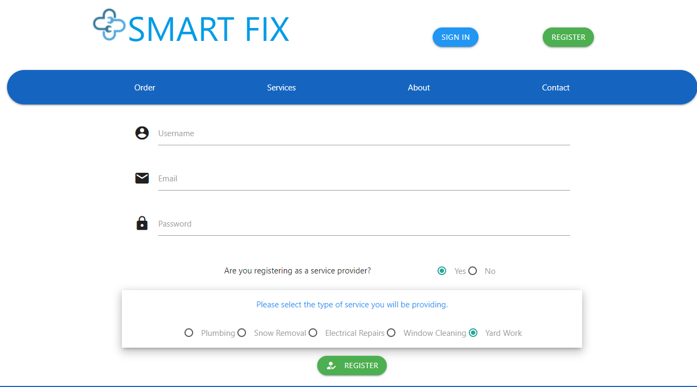
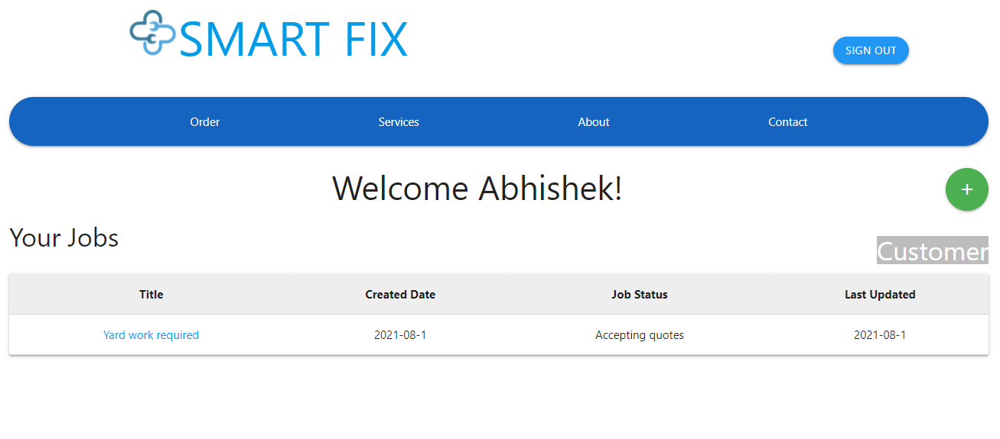
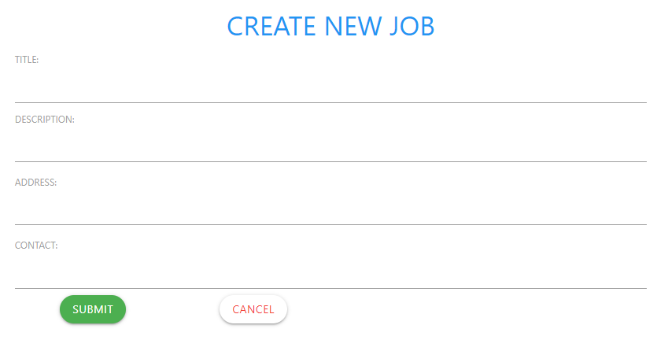
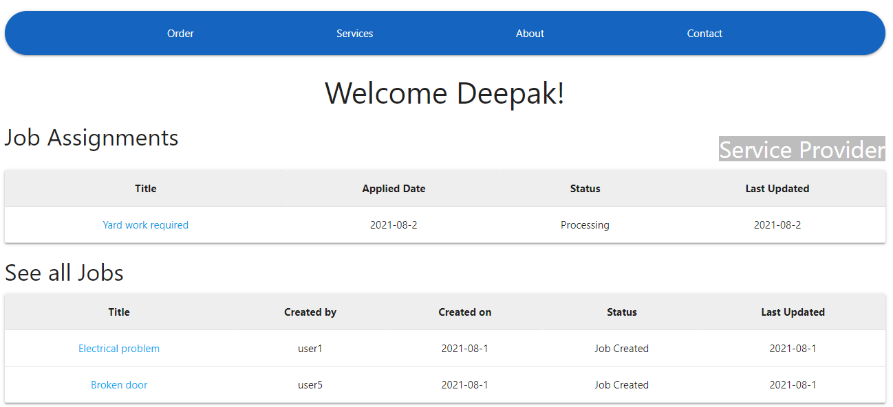
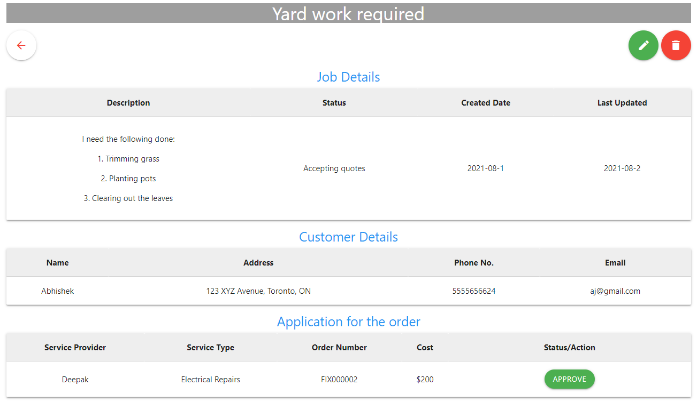
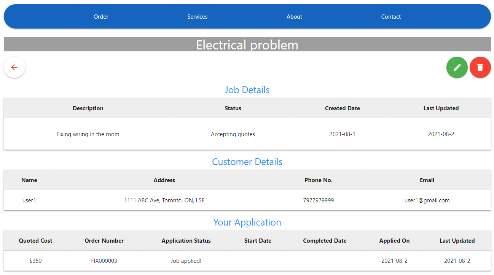

# SMART-FIX

Click [HERE](https://floating-cove-91289.herokuapp.com/) to access the webapp.
## Version 1.0
## Introduction:
Smart-Fix is a full-stack web application that is an on-demand, solutions-based application connecting users to service providers with their day-to-day repairs and maintenance needs. 

## Table of Contents:

* [Motivation](#motivation)
* [Usage](#usage)
* [Tests](#tests)
* [Future Development](#future-development)
* [Packages](#packages)
* [Created By](#created-by)

## Motivation:
We recognize the need for a platform that can enable users to easily connect with reliable service providers. We wanted to create a platform that enables us to add certified service providers to our database, and their performance backed by user reviews. This will help create more jobs for service providers while providing an easy-to-use platform for the users.

>Home Page

## Usage:
To use this app please follow the below steps:
* Register
  * To register please click on the register button and enter username, email and password.
  * Email must be unique and not used by any other registered user.
  * To register as a **_service provider_**, click yes on "Are you registering as a service provider".
  * User can then select the service from the list.

* Sign in
  * Enter the email address and the password with which you are registered to log in.

Depending on whether the user has registered as a customer or service provider, the order page will have a different look.

* As a Customer:
  * You can see table of all the jobs created by you.
  * You can create new job by clicking the plus button.
  * A create new job form will appear. To create a new job, enter a title, a detailed description of the job, address wher the job is to be performed and a contact number.
  * Please note, only numeric values will be accepted as contact number.

* As a Service Provider:
  * You can see all the jobs created by customers under "See all Jobs"
  * Jobs that you have applied for will appear under a sperate tab, "Job Assignments"

Both customers and service provider can view a job detail, the view and the options available will differ based on the user.

* As a Customer:
  * You can see all the details of your job and any applications made by the service provider.
  * You have the option to delete your job and edit it.
  * Clicking edit will allow you to change the job title, description, address or contact.
  * All applications made for the job by service providers will appera under "Applications for the order"
  * You can select any one of the orders and approve it by clicking the approve button.
  * If there are multiple applications, approving one will automatically reject others.

* As a Service Provider:
  * You have the option to apply for a job by clicking on the apply button.
  * When clicked, you are required to provide an estimate cost for completing the job (Only decimal values are accepted).
  * If you have already applied for a job, you have the option to delete or edit your application.
  * Clicking delete will delete your application.
  * If you application was accepted by the customer, the job status will reset to "Accepting quotes".
  * Clicking edit will give the service provider to edit the cost of performing the job.
  * If application is accepted by the user, service provider can also update start date and complete date.

All orders go through a series of steps from creation to being marked as completed by the system.
  * As a customer when you create a job, its status is shown as "Job Created".
  * Once created all service providers can see this job on their order dashboard and can apply for it.
  * Once an application is made, job status updates to "Accepting quotes".
  * At this point as a service provider your application status is shown as "Job Applied".
  * When the customers approve a job application, job status updates to "Service Provider Confirmed".
  * As a service provider, depending on whether your application is accepted or rejected, your application status will update to "Application accepted" or "Application rejected".
  * Service provider whose application is accepted can now edit and update start date and complete date.
  * Updating them will move the job status to "Job Started" and then to "Job completed"

## Tests:
Testing is not available.

## Future Development
* Forums where users can discuss their issues:
 * All users will be able to create posts and add comments to discuss their issues.

* Ratings
 * Once a job is completed, customer can rate the service provider based on the job done.
 * Rating for the service provider will be stored and visible to the customer.

## Packages:

* [Node.js](https://nodejs.org/en/)
* [Express.js](https://expressjs.com/)
* [Handlebars.js](https://handlebarsjs.com/)
* [MySQL](https://www.mysql.com/)
* [Sequelize ORM](https://sequelize.org/)
* [bcrypt](https://www.npmjs.com/package/bcrypt)
* [connect-session-sequelize](https://www.npmjs.com/package/connect-session-sequelize)
* [dotenv](https://www.npmjs.com/package/dotenv)
>New Technology
* [Materialize](https://materializecss.com/)

## Created By:
* [Abhishek Jamwal](https://github.com/jamwalab)
* [Sonali Pandey](https://github.com/sonali-pandey)
* [Don Seneviratna](https://github.com/DonNavinS)
* [Rabeea Jahangir](https://github.com/rabeeajahangir)
* [Sudhanshu Batra](https://github.com/sudbatra)
* [Marta N](https://github.com/martaniz).

 
